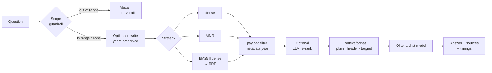

# localrag

**A local-first RAG engine that measures its own grounding:** pluggable retrieval (dense, MMR,
hybrid BM25 + dense with reciprocal-rank fusion, LLM re-ranking), hallucination guardrails, and
a reproducible evaluation harness, running entirely on your machine with Ollama and embedded
Qdrant.

[](https://github.com/samhgold16/Custom-Rag-Pipeline/actions/workflows/ci.yml)


Building a RAG demo takes an afternoon. Knowing *when* it is wrong, and which change actually
fixes it, is the hard part. `localrag` pairs the pipeline with the instruments to measure and determine when it is right.
The demo corpus is a set of fictional shareholder letters, so no
model has prior knowledge of it and every correct answer has to come from retrieval.

## Quickstart

Requires [uv](https://docs.astral.sh/uv/) and [Ollama](https://ollama.com/download) (a recent
release; `rag doctor` checks it).

```bash
uv sync
ollama pull hf.co/openbmb/MiniCPM5-2B-GGUF:Q4_K_M && ollama pull nomic-embed-text
uv run rag doctor
uv run rag ingest
uv run rag ask "How many qubits did QuantumMind have in 2031?"
```

```
$ uv run rag ingest
quantummind: 6 documents → 14 chunks, 768-d vectors · +14 / -0 (rebuilt) · 1.65s
  year: 2030–2035 (6 values)
$ uv run rag ingest
quantummind: 6 documents → 14 chunks, 768-d vectors · unchanged, nothing embedded · 0.00s

$ uv run rag ask "How many qubits did QuantumMind have in 2031?"
╭──────────────────────────────── Answer ────────────────────────────────╮
│ In 2031, QuantumMind had expanded its quantum hardware capabilities to │
│ reach 250 qubits.                                                      │
╰──────── quantummind · dense k=4 filter=year:[2031] · context=header ───╯
Guardrail (filter): Scoped the search to year 2031.
 # │ Source   │ year │ Score │ Excerpt
 1 │ 2031.txt │ 2031 │ 0.696 │ Dear Shareholders, As we reflect on the past year at Quantu…
 2 │ 2031.txt │ 2031 │ 0.635 │ Our stock price has experienced some volatility as the mar…

$ uv run rag ask "what was the max qubits that Quantum mind reached in 2023?"
╭──────────────────────────────── Answer ────────────────────────────────╮
│ I don't know. The indexed documents cover year 2030–2035; there is     │
│ nothing for 2023.                                                      │
╰──────────────── quantummind · dense k=4 · context=header ──────────────╯
Guardrail (abstain): The indexed documents cover year 2030–2035; there is nothing for 2023.
```

(Real output, trimmed and re-wrapped. The guardrail turns an in-range year into a payload filter
and refuses an out-of-range one without calling the model.)

Then try `uv run rag demo` for a narrated tour, or `uv run rag eval` to reproduce the results
below.

## Features

**Ingest**
- `.txt` / `.md` folders of any domain; chunking via recursive character splitting.
- Metadata extracted from file paths by configurable regex rules (`year`, `team`, `date`…),
  stored as Qdrant payload.
- Idempotent, incremental ingest: content-addressed point IDs (`uuid5`), a diff against the
  stored IDs, and a manifest that forces a rebuild when the embedding model changes. An
  unchanged corpus costs zero embedding calls.

**Retrieval**
- Strategy registry: **dense** (cosine kNN), **MMR** (maximal marginal relevance),
  **hybrid** (Okapi BM25 ‖ dense, fused with a hand-written weighted **reciprocal-rank fusion**).
  New strategies are one decorated function.
- **Payload filters** (`metadata.year ∈ {…}`) applied inside every strategy, mirrored in BM25.
- **LLM re-ranking** as a post-processor on any strategy, with first-number score parsing (clamped to 0–10).

**Guardrails and query processing**
- **Scope guardrail**: years in the question are checked against the years in the index.
  Out of range: a deterministic refusal with no LLM call. In range: an automatic payload filter.
- **Context formats** decided at prompt time (`plain`, `header`, `tagged`), independent of what
  was embedded.
- **Two-step query rewriting** that is rejected in code if it changes any year in the question.

**Evaluation**
- JSONL gold set: answerable, summary, and unanswerable questions with required/forbidden terms
  and gold sources.
- Deterministic metrics: accuracy, abstention on unanswerables (the inverse of hallucination
  rate), false abstentions, hit@k, MRR, p50/p95 latency.
- Reports record git SHA, Ollama version, model **digests**, package versions, and a dataset hash.

**Engineering**
- Typed `src/` package with dependency injection; LangChain 1.x split packages only (LCEL, no
  legacy chains).
- 130 unit tests (96% line coverage) that run offline with fake models and in-memory Qdrant; live
  integration tests behind a marker.
- Typer + Rich CLI with `--json` output, `rag doctor` diagnostics, ruff, and GitHub Actions CI on
  Python 3.11–3.13.

## Architecture



## Results

22 gold questions (18 answerable, 4 unanswerable) on the demo corpus, MiniCPM5-2B (Q4_K_M) at
temperature 0, `nomic-embed-text`, Ollama 0.35.1. Each row changes one thing relative to the
row it builds on. 

| Config | What it adds | Accuracy | Unanswerable abstained | False abstentions | Hit@k | MRR | p50 s |
| ------ | ------------ | -------: | ---------------------: | ----------------: | ----: | --: | ----: |
| `baseline` | original pipeline: plain chunks, dense k=4 | 64% | 75% | 17% | 88% | 0.63 | 1.38 |
| `hdr-embedded` | year header embedded with the text | 77% | 100% | 6% | 100% | 0.82 | 1.57 |
| `hdr-prompt` | year header at prompt time only | 82% | 100% | 6% | 88% | 0.63 | 1.36 |
| `tagged` | `[source \| year]` label + cite rule | 82% | 75% | 0% | 88% | 0.63 | 2.77 |
| `mmr` | hdr-prompt + MMR (λ=0.5) | 77% | 100% | 17% | 82% | 0.62 | 3.35 |
| `mmr-k2` | … with k=2 | 64% | 100% | 28% | 71% | 0.59 | 2.06 |
| `hybrid` | hdr-prompt + BM25 ‖ dense, RRF | **86%** | 100% | **0%** | **100%** | 0.88 | 2.18 |
| `rerank` | hdr-prompt + LLM re-rank (8 → 4) | **86%** | 100% | 17% | 94% | 0.68 | 6.44 |
| `rewrite` | hdr-prompt + two-step rewrite | 82% | 100% | 6% | 88% | 0.66 | 2.41 |
| `guardrail` | hdr-prompt + scope guardrail | 82% | 100% | 6% | 88% | 0.66 | 1.62 |
| `hybrid+guardrail` | hybrid + scope guardrail | **86%** | 100% | **0%** | **100%** | **0.96** | 1.78 |

What the numbers say:

- **Presentation beat retrieval for hallucination.** Adding the year at prompt time took
  accuracy from 64% to 82% and fixed the 2023 fabrication with *identical* retrieval
  (same hit@k and MRR as the baseline).
- **Hybrid BM25 + dense was the best retriever** (86%, hit@k 100%, no false abstentions). It
  fixed both year-confusable baseline failures (q07: 2033 *downsized* vs 2034 *rehired*; q08:
  quantum-inspired algorithms vs the 2031 cloud service). One caveat: its q07 answer says
  "downsized" but dates it 2034. The term-based metric checks content, not attribution.
- **The LLM re-ranker matched hybrid's accuracy at about 3× the latency** (6.4 s vs 2.2 s median)
  and abstained more often. Not worth it here.
- **Hand-tuning did not generalise.** MMR with k=2, originally chosen because it fixed one
  question, is the worst retrieval config on the full set (64%). MMR at k=4 also trailed plain
  dense retrieval.
- **A richer label was worse at the thing that mattered.** `tagged` had the best answerable
  accuracy of the grounding variants but was the only one of them that still fabricated on the
  2023 question.
- **Rewrite and guardrail added no accuracy here.** With header context the model already
  abstained on every unanswerable question; the guardrail makes that refusal deterministic and
  model-independent. One question (q09) fails almost everywhere: the model cites "extraordinary
  events" and omits the breakthrough that the letter names in the next paragraph.

## Using it as a library

```python
from localrag import RAGEngine, RetrievalConfig, Settings

engine = RAGEngine(Settings(data_dir="data/quantummind"))
engine.ingest()  # idempotent; fast on re-run

answer = engine.ask(
    "What alternative approach is QuantumMind exploring to generate near-term revenue?",
    retrieval=RetrievalConfig(strategy="hybrid", k=4),
)
print(answer.text)
for src in answer.sources:
    print(src.metadata.get("year"), src.source, round(src.score, 3))
```

`RAGEngine` accepts any LangChain `BaseChatModel` / `Embeddings` and a `QdrantClient`, which is
how the tests run the real pipeline against fakes. More in [`examples/`](examples/):
`quickstart.py`, `hallucination_case_study.py`, `compare_retrievers.py`.

## Your own documents

Point `[corpus]` at a folder and describe which metadata lives in the file paths for new data.

```toml
[corpus]
data_dir = "notes"

[[metadata.fields]]
name = "team"
pattern = '^([a-z-]+)/'        # notes/platform/2025-03-14-review.md → team = "platform"

[[metadata.fields]]
name = "year"
pattern = '(\d{4})-\d{2}-\d{2}'
type = "int"
```

```bash
uv run rag -c notes.toml ingest
uv run rag -c notes.toml ask "What caused the March outage?" --filter team=platform
```

## CLI

| Command | Purpose | Key options |
| ------- | ------- | ----------- |
| `rag doctor` | Check Ollama, models (+ digests), chat template, Qdrant lock, corpus | |
| `rag ingest` | Incremental, idempotent indexing | `--data-dir`, `--header FIELD`, `--rebuild`, `--json` |
| `rag ask "…"` | Answer with sources | `-s dense\|mmr\|hybrid`, `-k`, `--year`, `--filter f=v`, `--rerank`, `--rewrite`, `--no-guardrail`, `--context plain\|header\|tagged`, `--json` |
| `rag eval` | Run a config grid over a gold set, write a report | `--dataset`, `--grid default\|quick`, `--only NAME`, `--out` |
| `rag demo` | Narrated end-to-end tour | |

Global: `-c/--config FILE`, `-v/--verbose`.

## Project layout

```
src/localrag/
├── engine.py            RAGEngine facade
├── config.py            Settings, RetrievalConfig, FieldRule (TOML + env)
├── ingest.py            load → split → enrich → diff → upsert
├── enrichers.py         path-regex fields, text header, content hash
├── store.py             embedded Qdrant lifecycle, filters, manifest
├── retrieval/           registry · fusion.py (RRF) · bm25.py · rerank.py
├── query.py             scope guardrail, two-step rewrite
├── generation.py        prompts, context formats, abstention detection
├── providers.py         provider seam, Ollama health + chat-template check
├── evaluation/          dataset · metrics · runner (grids) · report
└── cli.py, demo.py      Typer CLI, narrated tour
data/quantummind/        demo corpus (6 letters, 2030–2035)
eval/quantummind.jsonl   22 gold questions
results/                 generated reports + the original baseline
docs/                    architecture, configuration, evaluation, decisions, case study
examples/                runnable scripts using the public API
tests/unit/              offline;  tests/integration/  live Ollama
```

## Development

```bash
uv run pytest                     # unit tests, offline
uv run pytest -m integration      # live tests (needs `ollama serve` and both models)
uv run ruff check . && uv run ruff format --check .
```

Conventions for contributors and coding agents are in [`AGENTS.md`](AGENTS.md).

## Origin

This project grew out of a retrieval-augmented generation lab in Georgetown's DSAN 6725
(*Applied Generative AI for AI Developers*, Fall 2026). The course provided a starter pipeline
and the synthetic data. I have since rebuilt it as a package on LangChain 1.x and
added the incremental ingest, hybrid retrieval with my own RRF and BM25 tokenizer, the scope
guardrail and constraint-preserving query rewriting, prompt-time context formats, the
evaluation harness and gold set, the CLI, configuration for arbitrary corpora, and the test
suite and CI.

## License

[MIT](LICENSE).
